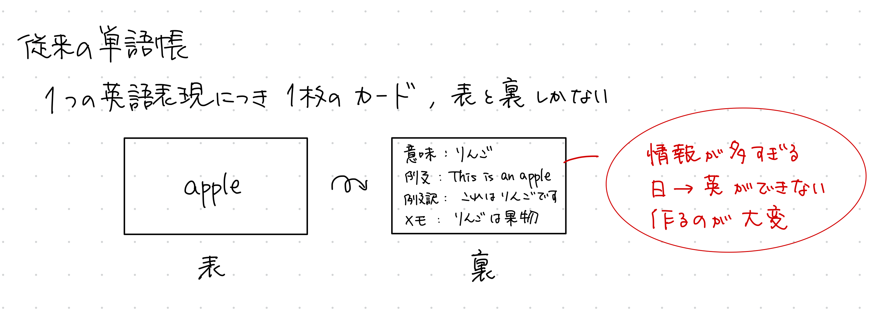
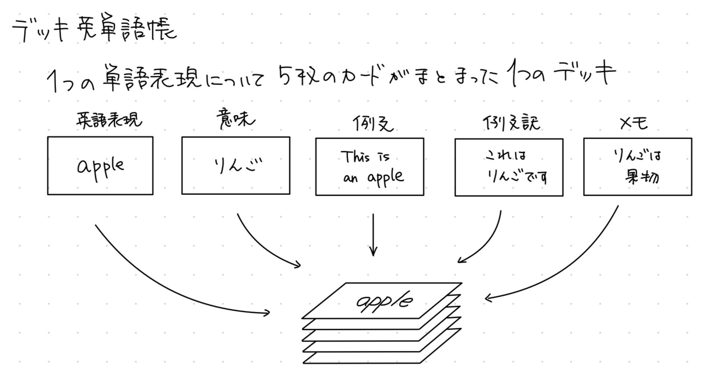

# プロジェクト名
デッキ単語帳 / Vocab Deck

## 概要
このアプリケーションは、従来の単語帳の弱点を克服するために目指して作られた、英単語帳アプリです。
### 従来の単語帳の問題点
従来の単語帳は「表と裏」の2面しかないため、英語学習において重要な、例文、訳文、文脈、豆知識と言った重要な情報が抜け落ちていました。
もちろん、これらの情報を単語帳の「裏」に書くこともできますが、これにより
- 裏面の情報量が多くなる
- 「日本語 → 英語」の練習ができない
- 作るのが大変

という問題点がありました。

### 本アプリのアイデア
そこで、一つの英語表現に対して、英単語、意味、例文、訳文、メモといった個々の情報を「カード」に記録し、これらを一つの「デッキ」としてまとめ、これをめくるように学習することで、より楽に、効果的に、楽しく語彙を学べるのではないかと思い、このアプリの開発に至りました。

## 機能
### **必ず実装したい機能**
**ホーム画面**
- デバイス毎のデータの管理
- 英単語のみの一覧画面とすべての情報一覧画面
- 作った作成日時を記録する
- 作った作成日時で並び替える
- 優先度で並び替える
- 作成日時や優先度を範囲指定できる
- デッキ編集画面を作る

**単語作成画面**
- 手動でデッキを作れる
- scv, tsvをベタ打ちで一気にデッキを作れる
- デッキに5つのカード(入力項目)がある
- 優先度はスライダーで入力できる

**テスト画面**
- タップで次々にカードをめくることができる
- 未入力のカードは表示させない
- スライダーと編集画面遷移ボタンを表示する
- めくるデッキの個数を自分で設定できる
- めくるときのアニメーション機能

### **できればあとから追加したい機能**

-ログイン/ログアウト機能
-ユーザ情報編集画面
-ユーザーごとのデバイスの管理
-優先度のデータ更新ボタン(優先度を2つくることで実装可能か？)
-復習した回数を記録してなにかしらの方法で表示する
-進捗管理/進捗の表示
-フォルダを作れるようにする
-1つのデッキのカードの枚数も自分で決められる
-カードの順番を自分で変えられる（すべてのデッキで適用される）
-カウンター/スライダーの数値の幅を自分で設定できる
-デッキごとにカードの順番を変えられる
-テスト中のスライダーを表示/非表示を設定できる
-csv, tsvなどのファイルを読み込んで単語カードを作る
-音声読み上げ機能をつける
-自動めくり機能をつける
-画像を入力/表示できるようにする
-YouGlishや辞書アプリなど外部サイトに繋げられる
-サードパーティ性のログイン認証機能
-メール通知機能
-SRS(Spaced Repetition System: 間隔反復システム)の実装
-きれいなレイアウトによるA4プリント機能
-登録したデッキを表にして一覧、編集、並べ替えができる
-日にちが経つに連れ自動で優先度を上げていく
-設定の言語を日英で切り替えられる

## 使用技術
- フロントエンド: React(TypeScript) ver 18
- バックエンド: Next.js ver 14.2.6
- データベース: Supabase(予定), 現時点では静的なデータを用意してフロントのみ実装してます

